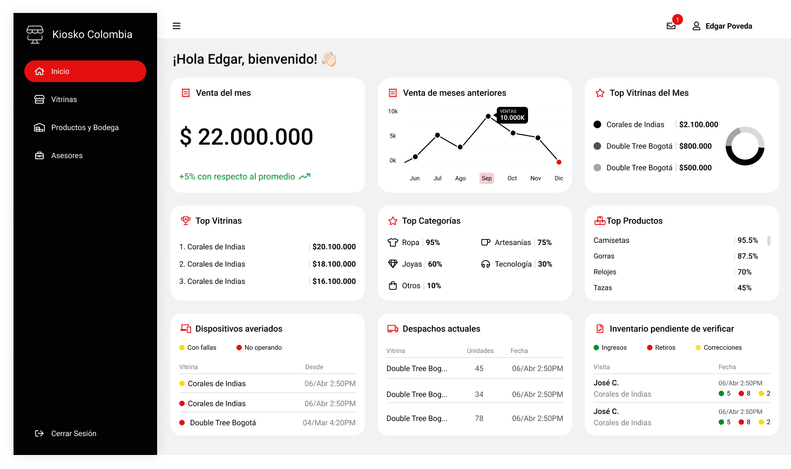
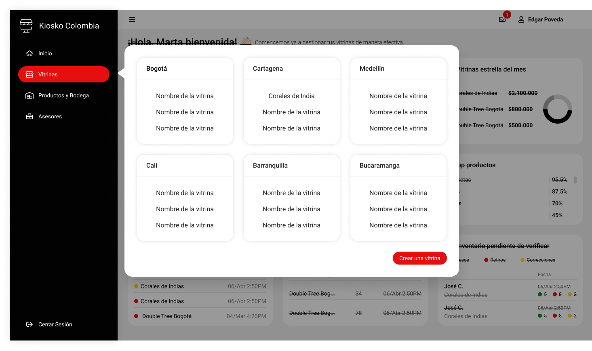
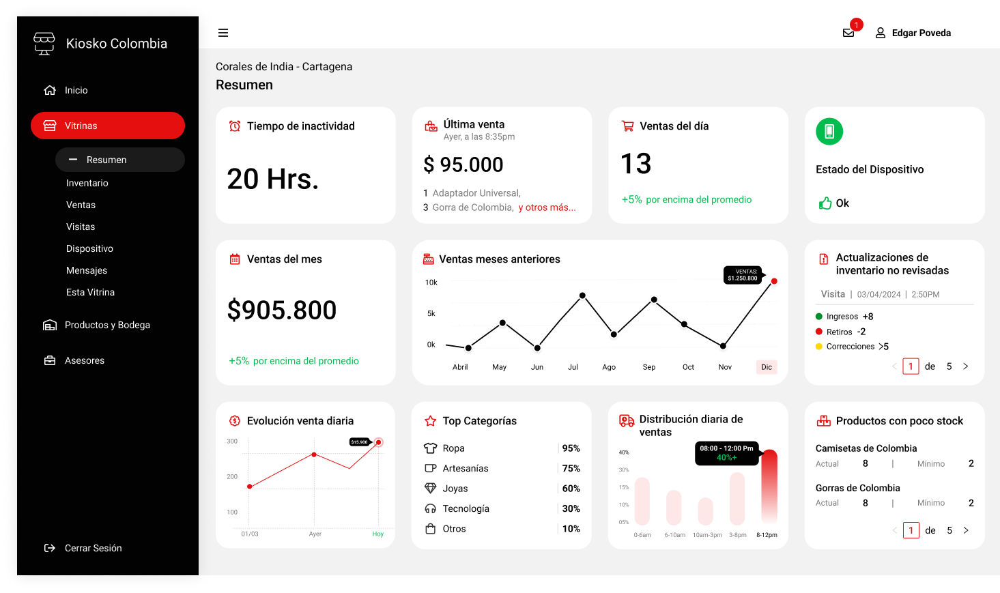
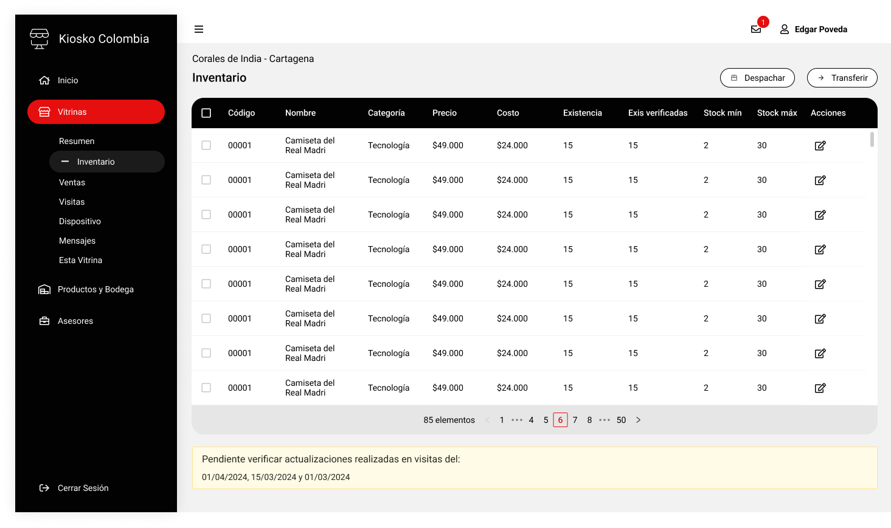

# Información relevante sobre este proyecto

En este proyecto debe crearse todo el frontend del sistema de gestión de vitrinas. El administrador del negocio utilizará esta app para gestionar toda la información relevante que las distintas vitrinas (puntos de venta) pueden ofrecer en tiempo real. En la app podrá encontrar, entre otras cosas, información sobre ventas, inventarios, visitas realizadas por asesores, predicciones de desempeño, novedades generales, etc.

## Diseño de interfaz

El número de pantallas, así como el diseño general de la interfaz de usuario, ha sido definido e ilustrado en un [proyecto Figma](https://www.freelancer.com.co/users/l.php?url=https:%2F%2Fwww.figma.com%2Fproto%2FiDzAkkNmIleLntLgkYJ1hk%2FVitrinas%3Fpage-id%3D7101%253A46349%26node-id%3D11815-4497%26viewport%3D131%252C759%252C0.13%26t%3DmtcwNZjgFuNMblbA-1%26scaling%3Dmin-zoom%26starting-point-node-id%3D11815%253A4497&sig=cf58ec03274c234249753c1a394ca3c22b45f14e17602df9b96288607cbb9475).

Se adjuntan imágenes de algunas pantallas de la interfaz:

### `Pantalla Principal`

### `Menú de vitrinas`

### `Pantalla de una vitrina`

### `Inventario de una vitrina`

## API REST

El desarrollador de esta app dispondrá de servicios REST que le proporcionarán toda la información y las funcionalidades requeridas en cada pantalla del diseño. La documentación de dicha API es accesible a través de este [link Swagger](https://app.swaggerhub.com/apis-docs/sanpope/vitrinas-app/1.0#/). Todavía no hay un dominio definido para los servicios REST, por lo que se sugiere usar uno cualquiera para simular las pruebas en el entorno de desarrollo.
